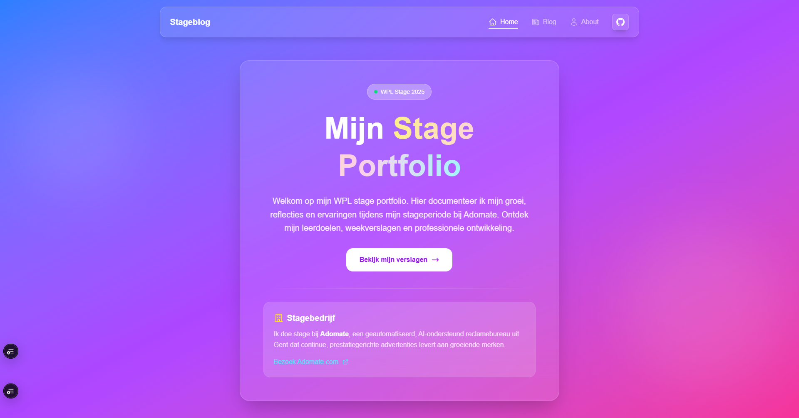
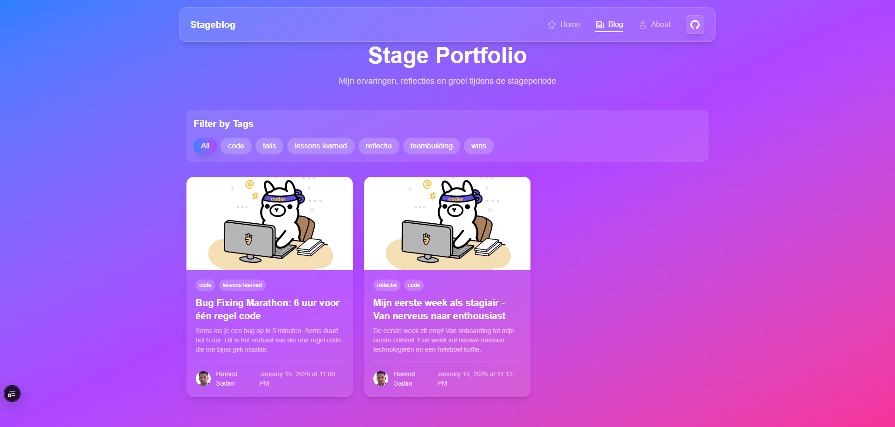
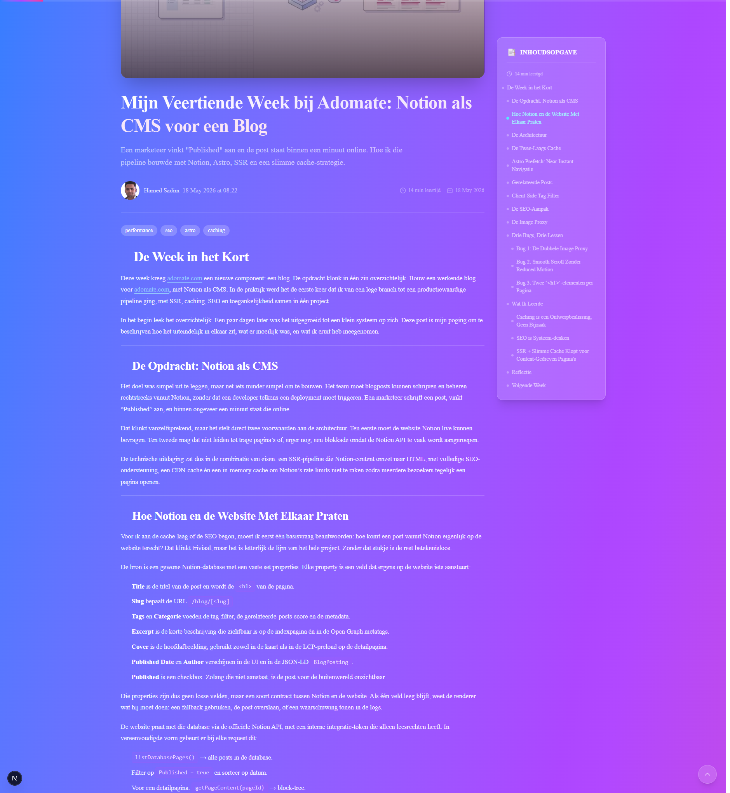
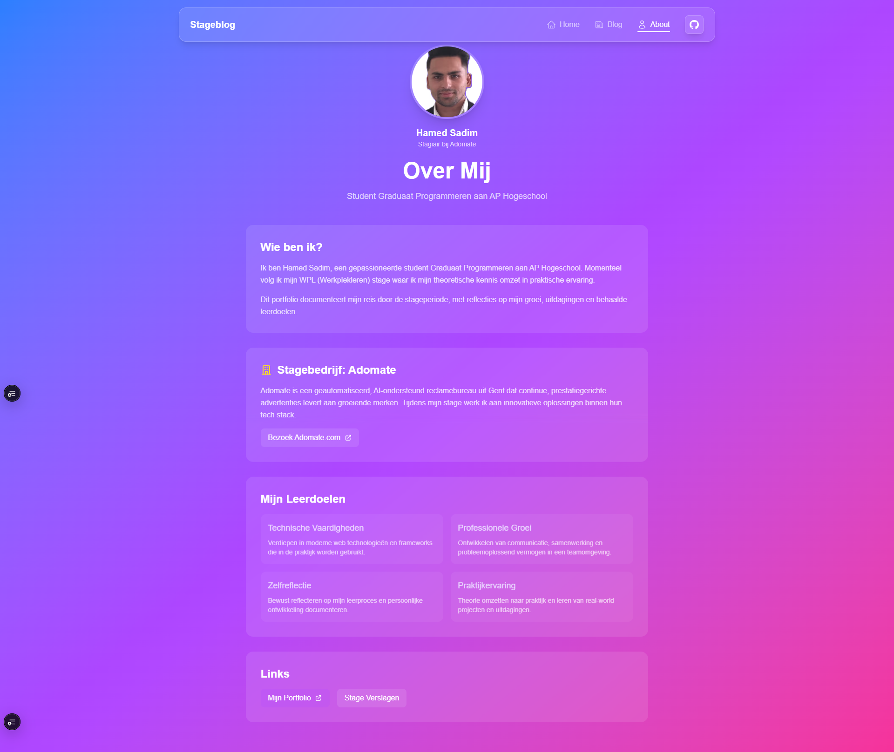

<div align="center">

# 📝 AP Stage Blog

### _Mijn reis door het werkplekleren_

[](https://nextjs.org/)
[](https://react.dev/)
[](https://www.sanity.io/)
[](https://www.typescriptlang.org/)
[](https://tailwindcss.com/)
[](https://bun.sh/)

<br/>

> 🎓 **AP Hogeschool** — Graduaat Programmeren — WPL Stage Portfolio
>
> 📅 Stageperiode: **Februari 2026 — Juni 2026**
>
> 🏢 Stage bij **[Adomate](https://www.adomate.com/)** — AI-ondersteund reclamebureau, Gent

<br/>

[🚀 Live Demo](#-live-demo) · [✨ Features](#-features) · [🛠️ Installatie](#️-installatie) · [📖 Tech Stack](#-tech-stack) · [📁 Projectstructuur](#-projectstructuur)

</div>

---

## 👋 Welkom

Dit is mijn **persoonlijke stageblog** waarin ik mijn ervaringen, uitdagingen en groei documenteer tijdens mijn werkplekleren (WPL) bij **Adomate** — een innovatief AI-ondersteund reclamebureau uit Gent.

Als student **Graduaat Programmeren** aan **AP Hogeschool** gebruik ik deze blog om:

- 📔 Dagelijkse ervaringen en lessen vast te leggen
- 🎯 Voortgang op leerdoelen te documenteren
- 💭 Te reflecteren op mijn professionele groei
- 🔧 Technische oplossingen en inzichten te delen

---

## ✨ Features

### 🎨 Frontend

| Feature                | Beschrijving                                        |
| ---------------------- | --------------------------------------------------- |
| ⚡ **Next.js 16**      | App Router met Server Components & Turbopack        |
| 🎭 **React 19**        | Nieuwste React met Actions & Server Components      |
| 💅 **Tailwind CSS 4**  | Utility-first CSS met CSS-first configuratie        |
| 📱 **Responsive**      | Volledig responsive design (mobile-first)           |
| 🫧 **Glassmorphism**   | Moderne UI met transparante kaarten en overlays     |
| 📈 **Reading Progress**| Real-time leesvoortgangsbalk                        |
| 📑 **Table of Contents**| Sticky sidebar met active section highlighting     |
| 📋 **Copy Button**     | Eén-klik kopiëren van code-blokken                  |
| 🏷️ **Tag Filtering**  | Filter blog posts op tag                            |
| 🔗 **JSON-LD SEO**     | Gestructureerde data voor Article, Breadcrumb, Person |

### 📝 Content (Markdown)

Blog posts ondersteunen rijke Markdown:

- 🏷️ **Tags** — Categorisatie en filtering van posts
- 💬 **Callout Boxes** — Success, Warning, Info & Danger containers
- 📊 **Tabellen** — Professioneel gestyled met hover effects
- 🎨 **Syntax Highlighting** — 180+ programmeertalen via highlight.js
- 🔗 **Heading Anchors** — Deep linking naar specifieke secties
- 📖 **Leestijd** — Automatische schatting op basis van woordenaantal

> 📘 Zie **[MARKDOWN_GUIDE.md](MARKDOWN_GUIDE.md)** voor de volledige Markdown-handleiding

### 📄 Pagina's

| Pagina                | Route              | Beschrijving                                      |
| --------------------- | ------------------ | ------------------------------------------------- |
| 🏠 **Home**           | `/`                | Landingspagina met hero-sectie en badge           |
| 📝 **Blog**           | `/blog`            | Overzicht van alle posts met tag-filter           |
| 📄 **Blog Post**      | `/blog/[slug]`     | Detailpagina met TOC, leesvoortgang & related     |
| 👤 **Over Mij**       | `/about`           | Profiel, leerdoelen, contact & links             |
| ✍️ **Admin (CMS)**   | `/studio`          | Sanity Studio voor contentbeheer                  |

---

## 🛠️ Installatie

### Vereisten

- [Bun](https://bun.sh/) **1.2+** (aanbevolen) of [Node.js](https://nodejs.org/) **18+**
- [Git](https://git-scm.com/)
- Een **Sanity** account (gratis tier beschikbaar)

### Quick Start

```bash
# 1️⃣ Clone de repository
git clone https://github.com/HamedSadim1/ap-intership-blog.git
cd ap-intership-blog

# 2️⃣ Installeer dependencies
bun install

# 3️⃣ Configureer environment variables
cp .env.example .env.local
# Vul de benodigde Sanity API keys in (zie volgende sectie)

# 4️⃣ Start de development server
bun run dev
```

De app is nu beschikbaar op **[http://localhost:3000](http://localhost:3000)**.

### 🔑 Environment Variables

Maak een `.env.local` bestand aan in de project-root:

```env
# Sanity CMS — Verplicht (krijg je via de Sanity dashboard)
NEXT_PUBLIC_SANITY_PROJECT_ID=your_project_id
NEXT_PUBLIC_SANITY_DATASET=production

# Sanity CMS — Optioneel (defaults naar 2026-01-15)
# NEXT_PUBLIC_SANITY_API_VERSION=2026-01-15

# Sanity CMS — Alleen nodig voor Sanity Live previews in productie
# SANITY_API_TOKEN=your_api_token
```

> **Waar vind ik deze waarden?** Log in op [sanity.io/manage](https://sanity.io/manage), selecteer je project en kopieer de `Project ID` en `Dataset` naam.

### 📦 Husky Hooks

Dit project gebruikt **Husky** voor geautomatiseerde Git hooks:

| Hook          | Actie                                    |
| ------------- | ---------------------------------------- |
| **pre-commit**| `bun run lint` + `bunx tsc --noEmit`     |
| **pre-push**  | `bun run build`                          |

Hooks worden automatisch geactiveerd na `bun install`.

---

## 🎯 Scripts

| Commando                  | Beschrijving                                |
| ------------------------- | ------------------------------------------- |
| `bun run dev`             | Start Next.js development server (Turbopack)|
| `bun run build`           | Bouw de productie versie                    |
| `bun run start`           | Start de productie server                   |
| `bun run lint`            | Voer ESLint uit                             |
| `bun run typegen`         | Genereer Sanity TypeScript types            |
| `bunx tsc --noEmit`       | TypeScript typecheck                        |

> **Let op:** `predev` en `prebuild` scripts voeren automatisch `bun run typegen` uit, zodat de Sanity types altijd up-to-date zijn.

---

## 🚀 Deploy

### Vercel (aanbevolen)

De app is geoptimaliseerd voor deploy op **Vercel**:

1. Verbind je GitHub repository met [Vercel](https://vercel.com/)
2. Stel de environment variables in (zie [🔑 Environment Variables](#-environment-variables))
3. Vercel herkent Next.js automatisch — geen extra configuratie nodig

```bash
# Of via de Vercel CLI
vercel --prod
```

Een **GitHub Actions workflow** (`.github/workflows/vercel-preview.yml`) kan preview deploys genereren voor pull requests.

### CI/CD Pipeline

| Workflow              | Trigger             | Actie                                    |
| --------------------- | ------------------- | ---------------------------------------- |
| `lint.yml`            | Push + PR naar main| Linting + TypeScript typecheck           |
| `vercel-preview.yml`  | PR naar main        | Preview deploy op Vercel                 |

---

## 📁 Projectstructuur

```
ap-intership-blog/
├── 📂 app/
│   ├── 📂 (site)/                 # Publieke site (route group)
│   │   ├── 📂 about/              # Over mij pagina
│   │   ├── 📂 author/             # Auteur pagina (placeholder)
│   │   ├── 📂 blog/               # Blog overzicht
│   │   │   └── 📂 [slug]/         # Individuele blog posts
│   │   ├── 📂 components/         # Site-componenten
│   │   │   ├── 📂 about/          # About-pagina componenten
│   │   │   ├── 📂 blog/           # Blog componenten (kaarten, TOC, etc.)
│   │   │   ├── 📂 not-found/      # 404-pagina componenten
│   │   │   ├── 📂 svgs/           # SVG iconen (13 herbruikbare iconen)
│   │   │   ├── 📂 ui/             # UI componenten (Badge, Button, Card, etc.)
│   │   │   ├── hero.tsx           # Hero sectie (homepage)
│   │   │   └── navbar.tsx         # Navigatiebalk
│   │   ├── 📂 data/               # Statische content & metadata
│   │   ├── layout.tsx             # Site layout
│   │   └── page.tsx               # Homepage
│   ├── 📂 components/             # App-level componenten
│   │   └── TagFilter.tsx          # Tag filter (client-side)
│   ├── 📂 studio/                 # Sanity Studio
│   ├── globals.css                # Globale styles (Tailwind v4)
│   ├── layout.tsx                 # Root layout
│   ├── not-found.tsx              # 404 pagina
│   ├── robots.ts                  # Robots.txt configuratie
│   └── sitemap.ts                 # Dynamische sitemap
├── 📂 components/                 # Third-party UI (shadcn)
│   └── 📂 ui/
├── 📂 lib/
│   ├── 📂 hooks/                  # Custom React hooks
│   │   ├── useReadingProgress.ts  # Leesvoortgang tracker
│   │   ├── useScrollPosition.ts   # Scroll positie detectie
│   │   └── useScrollVisibility.ts # Zichtbaarheid detectie
│   ├── 📂 utils/                  # Utility functies
│   │   ├── array.ts               # Array helpers
│   │   ├── date.ts                # Datum formattering
│   │   ├── markdown.ts            # Markdown configuratie
│   │   ├── math.ts                # Wiskundige helpers
│   │   ├── reading-time.ts        # Leestijd berekening
│   │   ├── string.ts              # String helpers
│   │   ├── styles.ts              # Style constanten (gradients, classes)
│   │   └── tag-styles.ts          # Gedeelde tag styling
│   ├── constants.ts               # SSOT configuratie
│   ├── json-ld.ts                 # Gestructureerde data (SEO)
│   ├── sanity.ts                  # Sanity query functies
│   └── sync-user.ts               # User sync utility
├── 📂 sanity/
│   ├── 📂 lib/                    # Sanity client configuratie
│   │   ├── client.ts              # Sanity client (fetch / live)
│   │   ├── image.ts               # Image URL builder
│   │   ├── live.ts                # Live Content API
│   │   └── queries.ts             # GROQ queries
│   ├── 📂 schemaTypes/            # Sanity content schema's
│   │   ├── authorType.ts          # Auteur schema
│   │   ├── blockContentType.ts    # Markdown body schema
│   │   ├── postType.ts            # Blog post schema
│   │   └── tagType.ts             # Tag schema
│   ├── env.ts                     # Environment variabelen
│   ├── types.ts                   # Gegenereerde TypeScript types
│   └── extract.json               # Sanity schema extractie
├── 📂 .github/
│   └── 📂 workflows/              # CI/CD workflows
├── 📂 public/                     # Statische assets
│   └── 📂 screenshots/            # Screenshots voor README
├── package.json
├── next.config.ts                 # Next.js configuratie
├── sanity.config.ts               # Sanity Studio configuratie
├── sanity.cli.ts                  # Sanity CLI configuratie
├── tsconfig.json
└── components.json                # shadcn configuratie
```

---

## 📖 Documentatie

Naast deze README zijn er gespecialiseerde documentatiebestanden:

| Bestand                                      | Beschrijving                                   |
| -------------------------------------------- | ---------------------------------------------- |
| **[MARKDOWN_GUIDE.md](MARKDOWN_GUIDE.md)**   | Complete handleiding voor Markdown features    |
| **[PERFORMANCE.md](PERFORMANCE.md)**         | Performance optimalisaties & best practices    |
| **[REFACTORING.md](REFACTORING.md)**         | Refactoring geschiedenis & architectuur        |
| **[DRY_REFACTORING.md](DRY_REFACTORING.md)** | DRY-principe refactoring documentatie          |

---

## 🧩 Tech Stack

<div align="center">


</div>

### Kern

| Package                 | Versie  | Doel                                       |
| ----------------------- | ------- | ------------------------------------------ |
| `next`                  | 16.2.6  | React framework met App Router & Turbopack |
| `react` / `react-dom`   | 19.2.6  | UI library met Server Components           |
| `typescript`            | 6.0.3   | Type-safe JavaScript                       |
| `tailwindcss`           | 4.3.0   | Utility-first CSS framework                |

### CMS & Content

| Package                    | Versie   | Doel                                       |
| -------------------------- | -------- | ------------------------------------------ |
| `sanity`                   | 5.28.0   | Headless CMS + Studio                      |
| `next-sanity`              | 13.0.7   | Next.js + Sanity integratie (Live API)     |
| `@sanity/vision`           | 5.28.0   | Sanity GROQ query editor                   |
| `@sanity/image-url`        | 2.1.1    | Sanity image URL builder                   |
| `@sanity/icons`            | 3.7.4    | Icon set voor Sanity Studio schema's       |
| `sanity-plugin-markdown`   | 8.0.6    | Markdown editor in Sanity Studio           |

### Markdown & Code

| Package                    | Versie   | Doel                                       |
| -------------------------- | -------- | ------------------------------------------ |
| `markdown-it`              | 14.2.0   | Markdown → HTML parser                     |
| `markdown-it-anchor`       | 9.2.0    | Automatische heading anchors voor TOC      |
| `markdown-it-container`    | 4.0.0    | Custom callout containers (info, warning)  |
| `highlight.js`             | 11.11.1  | Syntax highlighting voor code blokken      |

### Styling & UI

| Package                    | Versie   | Doel                                       |
| -------------------------- | -------- | ------------------------------------------ |
| `@base-ui/react`           | 1.5.0    | Headless UI primitives (Button, Sheet)     |
| `class-variance-authority` | 0.7.1    | Variant-gebaseerde Tailwind classes        |
| `clsx`                     | 2.1.1    | Conditionele className merging             |
| `tailwind-merge`           | 3.6.0    | Tailwind class conflict resolutie          |
| `tw-animate-css`           | 1.4.0    | Tailwind CSS animatie utilities            |
| `lucide-react`             | 1.17.0   | Icoon set (gebruikt in Sanity Studio)      |

### Developer Experience

| Package                    | Versie   | Doel                                       |
| -------------------------- | -------- | ------------------------------------------ |
| `eslint`                   | 9.39.4   | Code linting                               |
| `eslint-config-next`       | 16.2.6   | Next.js ESLint configuratie                |
| `husky`                    | 9.1.7    | Git hooks voor code kwaliteit              |
| `@tailwindcss/postcss`     | 4.3.0    | Tailwind PostCSS plugin (v4)               |

---

## 🚀 Live Demo

> 🌐 **Productie:** [https://stageblog.vercel.app/](https://stageblog.vercel.app/)
>
> 💻 **Lokaal:** [http://localhost:3000](http://localhost:3000)
>
> ✍️ **Sanity Studio:** `/studio` (lokaal) of `/studio` op productie

---

## 📸 Screenshots

<details>
<summary>🖼️ Klik om screenshots te bekijken</summary>

<br/>

| Home Page                                       | Blog Overzicht                                  |
| ----------------------------------------------- | ----------------------------------------------- |
|   |   |

| Blog Detail Pagina                               | Over Mij                                        |
| ----------------------------------------------- | ----------------------------------------------- |
|  |  |

</details>

---

## 🧑‍💻 Over de Auteur

<table>
<tr>
<td width="120" align="center">

</td>
<td>

### Hamed Sadim

**Student Graduaat Programmeren** @ AP Hogeschool

🏢 Stagiair bij [Adomate](https://www.adomate.com/) — Gent

[](https://hamedsadim-portfolio.vercel.app/)
[](mailto:hamid.sadim@outlook.com)
[](https://github.com/HamedSadim1)

</td>
</tr>
</table>

### 🎯 Leerdoelen

Tijdens mijn stage focus ik op:

| Leerdoel                  | Beschrijving                                              |
| ------------------------- | --------------------------------------------------------- |
| 🔧 **Technisch**          | Verdiepen in moderne web technologieën (Next.js, Sanity) |
| 🤝 **Professioneel**      | Communicatie, samenwerking en Agile methodieken           |
| 🪞 **Reflectie**          | Bewust reflecteren op mijn leerproces en groei            |
| 💼 **Praktijk**           | Theorie omzetten naar real-world projecten                |

---

## 📄 Licentie

Dit project is gemaakt voor **educatieve doeleinden** als onderdeel van het curriculum **Graduaat Programmeren** aan **AP Hogeschool**.

---

<div align="center">

**Gemaakt met ❤️ door Hamed Sadim**

_Als onderdeel van de WPL Stage @ AP Hogeschool_

<sub>© 2026 — Alle rechten voorbehouden</sub>

</div>
